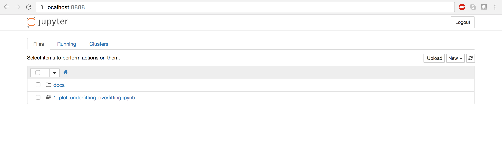

# Welcome to the data science quickstart!
By the end of this mini series you should understand the basic terminoligy surrounding data science/data mining and machine learning! Additionally, we will attempt to cover how and why specific machine learning models work, without diving too deep into theory. Note, this series assumes working knowledge of python, and I will attempt to translate any math presented. 

# Prerequisites
For new users, I *highly recommend* [installing Anaconda](https://www.continuum.io/downloads). Anaconda conveniently installs Python, the Jupyter Notebook, and other commonly used packages for scientific computing and data science.

Use the following installation steps:

1. Download [Anaconda](https://www.continuum.io/downloads). We recommend downloading Anaconda’s latest Python 3 version (currently Python 3.5).
1. Install the version of Anaconda which you downloaded, following the instructions on the download page.
1. Congratulations, you have installed Jupyter Notebook. To run the notebook:

```
jupyter notebook
```

See [Running the Notebook](Running the Notebook) for more details.

[Source](http://jupyter.readthedocs.io/en/latest/install.html#installing-jupyter-using-anaconda-and-conda)

# High level view of baby data mining pipeline
Assume we are given a dataset, `data`. getting this data is called **feature extraction**

```python
def trainModel(data, parameters):
    bestError = inf
    bestModel = None

    # Model validation
    for trainSplit, testSplit in split(data):
        trainFeat, testFeat = featureEngineering(trainSplit)
        model = train(trainFeat, parameters)

        testPred = predict(model, testFeat)
        testError = error(model, testPred) 

        # search for best model
        if testError < bestError:
            bestError = testError
            bestModel = model

    return bestModel

```

# Try it yourself



# Additional Resources 
* http://scikit-learn.org/stable/tutorial/machine_learning_map/index.html
* http://scikit-learn.org/stable/tutorial/basic/tutorial.html
* https://www.kaggle.com/
* https://www.kaggle.com/datasets
